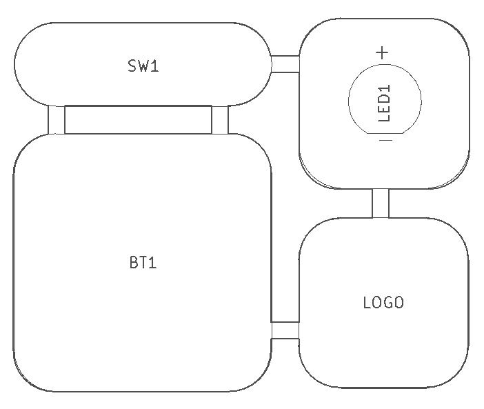
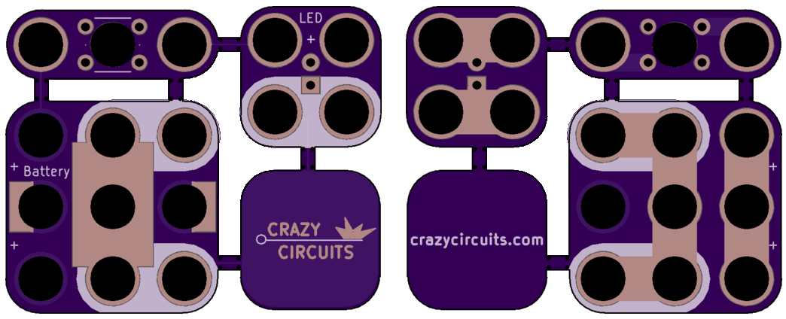

This is a circuit kit that can be snapped apart into three Lego-compatible modules. Just add a coin cell battery and light the LED by pressing the pushbutton.  

&nbsp;

|Module|Size|Description|Vendor|Part Number|
|------|----|-----------|------|-----------|
|BT1|3x3|CR2032 Battery|Digikey|952-1735-1-ND|
|LED1|2x2|LED|Lunchbox Electronics|<a href="http://lunchboxelectronics.com/product/build-upons-pth-edition">LegoLED</a>|
|SW1|1x2|Pushbutton|Digikey|SW400-ND|

&nbsp;

{width=60%}  

&nbsp;

  

