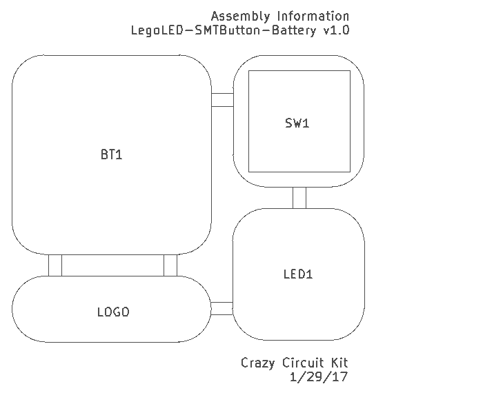
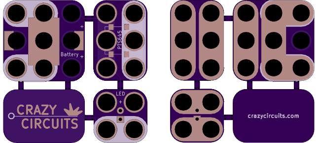

<!--- start title --->
# LegoLED-SMTButton-Battery Circuit Kit v1.1
Lego-compatible circuits by Brown Dog Gadgets

- Updated: 31 Jan 2017
- Website: http://browndoggadgets.com/
- Company: Brown Dog Gadgets
- License: All rights reserved.

<!--- end title --->
Circuit kit that can be snapped apart into three Lego-compatible modules. Just add a coin cell battery and press the button to light up the LED.

### Bill of Materials

<!--- bom start --->
|Ref|Qty|Description|Digikey PN|
|---|---|-----------|------|
|BT1|1|HOLDER BATT COIN CR2032/20MM|BK-912-ND|
|SW1|1|SWITCH MOMENT SPST-NO 0.05A 14V SMT PTS645|CKN9112TR-ND|

|Ref|Qty|Description|Lunchbox electronics PN|
|---|---|-----------|------|
|LED1|1|LED LEGO NOVELTY COLOR 5MM PITCH|COM-005|

<!--- bom end --->

