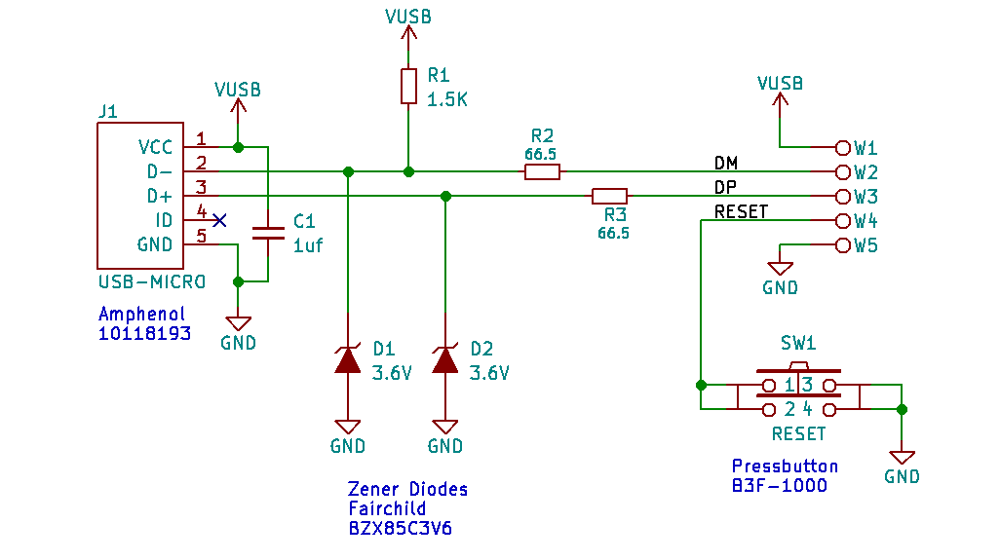
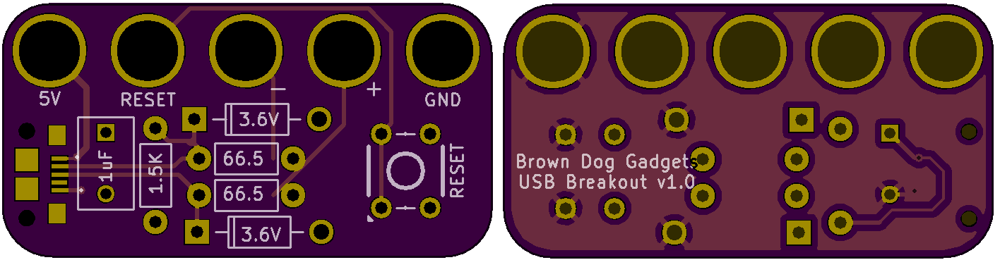
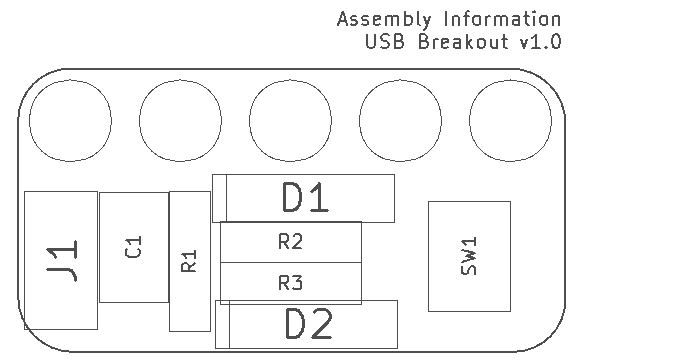

<!--- start title --->
# USB-Breakout-with-Reset v1.0

- Updated: 14 Feb 2017
- Website: http://browndoggadgets.com/
- Company: Brown Dog Gadgets
- License: All rights reserved.

<!--- end title --->

Circuit kit module to break out USB + and - signals, along with a RESET pushbutton, to program Rewire Circuit microcontrollers in place. 

<!--- start bom --->

|Refdes|Qty|Description|Digikey Number|
|------|---|-----------|--------------|
|C1|1|CAP CER 1UF 16V X7R RADIAL|445-8614-ND|
|D1,D2|2|DIODE ZENER 3.6V 1W DO41|BZX85C3V6-ND|
|J1|1|USB MICRO-B RECEPTACLE 5PIN SMT|609-4616-1-ND|
|R1|1|RES 1.5K OHM 1/2W 5% CF MINI|S1.5KHCT-ND|
|R2,R3|2|RES 66.5 OHM 1/4W 1% AXIAL|66.5XBK-ND|
|SW1|1|SWITCH TACTILE SPST-NO 0.05A 24V|SW400-ND|

<!--- end bom --->

