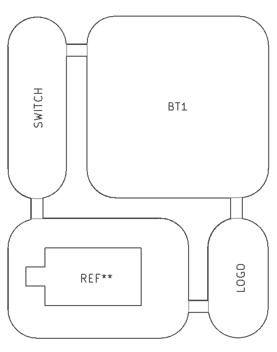
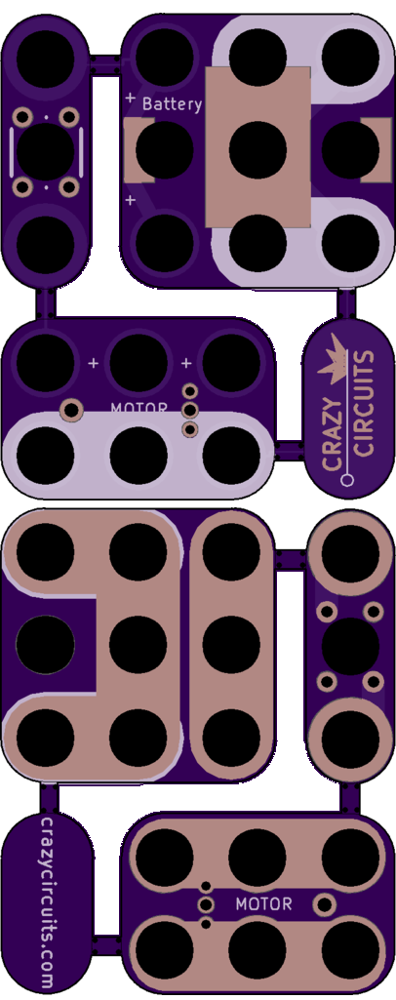

<!--- start title --->
# VibeMotor-Button-Battery Circuit Kit v1.1

Updated: 27 Dec 2016

Website: http://browndoggadgets.com/
Company: Brown Dog Gadgets
License: All rights reserved.

<!--- end title --->

Circuit kit that can be snapped apart into three Lego-compatible modules. Just add a coin cell battery and turn on the motor by pressing the pushbutton. 

<!--- start bom --->

|Ref|Qty|Description|Digikey PN|
|---|---|-----------|------|
|BT1|1|HOLDER BATT COIN CR2032/20MM|952-1735-1-ND|
|SW1|1|SWITCH TACTILE SPST-NO 0.05A 24V|SW400-ND|

|Ref|Qty|Description|Precision Microdrives PN|
|---|---|-----------|------|
|M1|1|MOTOR VIBE PCB 6MM - 10MM TYPE|<a href="https://www.precisionmicrodrives.com/product/306-114-6mm-vibration-motor-10mm-type">306-114</a>|

<!--- end bom --->

