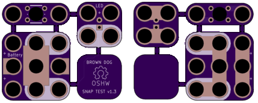
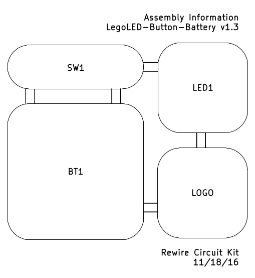

# LegoLED-Button-Battery Board

Lego brick LEDs from Lunchbox Electronics are in-place compatible with other 2.54mm-pitch, 5mm-diameter LEDs. 

This board can be snapped apart into the three different parts:

|Size|Description|Vendor|Part Number|
|----|-----------|------|-----------|
|3x3|CR2032 Battery|Digikey|952-1735-1-ND|
|2x2|LED|Lunchbox Electronics|<a href="http://lunchboxelectronics.com/product/build-upons-pth-edition">LegoLED</a>|
|1x2|Pushbutton|Digikey|SW400-ND|

