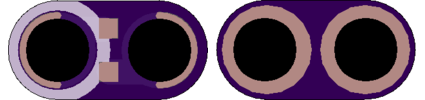
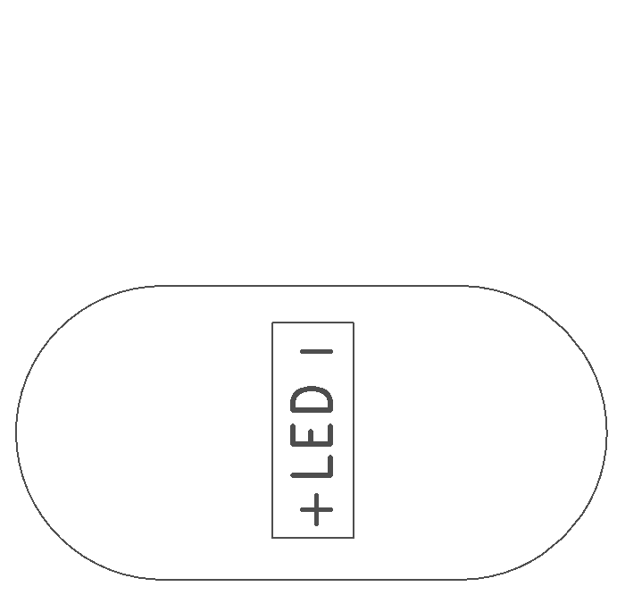

<!--- start title --->
# 1x2 Generic 1206 SMT Module v1.2
A Lego-compatible Crazy Circuits module

- Updated: 27 May 2017
- Website: http://browndoggadgets.com/
- Company: Brown Dog Gadgets
- License: CERN Open Hardware License v1.2.

<!--- end title --->
This module is for any surface mount component in the 1206 package. 

