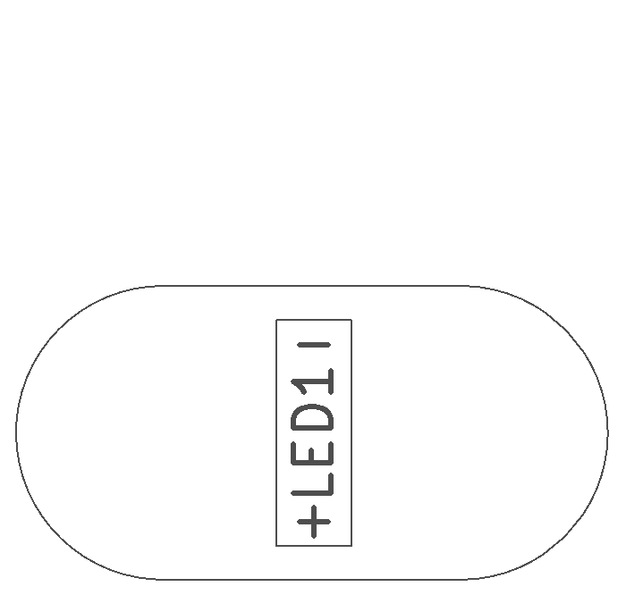
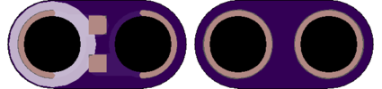

<!--- start title --->
# 1x2 LED 1206 SMT Module v1.2
A Lego-compatible Crazy Circuits module

- Updated: 27 May 2017
- Website: http://browndoggadgets.com/
- Company: Brown Dog Gadgets
- License: All rights reserved.

<!--- end title --->
Small standalone LED module. This part has no current limiting and so it should be used with only a 3V coin cell, not with USB or 5V!

<!--- bom start --->
### Bill of Materials

|Ref|Qty|Description|Digikey PN|
|---|---|-----------|------|
|LED1|1|LED GREEN CLEAR 1206 SMD|160-1456-1-ND|

<!--- bom end --->

