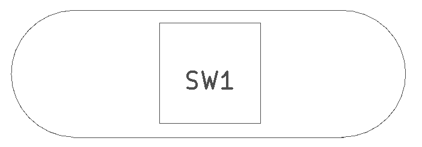

<!--- start title --->
# 1x3 Momentary Pushbutton SMT Module v1.0
A Lego-compatible Crazy Circuits module

Updated: 23 May 2017
- Website: http://browndoggadgets.com/
- Company: Brown Dog Gadgets
- License: All rights reserved.
<!--- end title --->

This is a small surface mount pushbutton.

<!--- bom start --->
### Bill of Materials

|Ref|Qty|Description|Digikey PN|
|---|---|-----------|------|
|SW1|1|SWITCH MOMENT SPST-NO 0.05A 14V SMT PTS645|CKN9112TR-ND|

<!--- bom end --->

