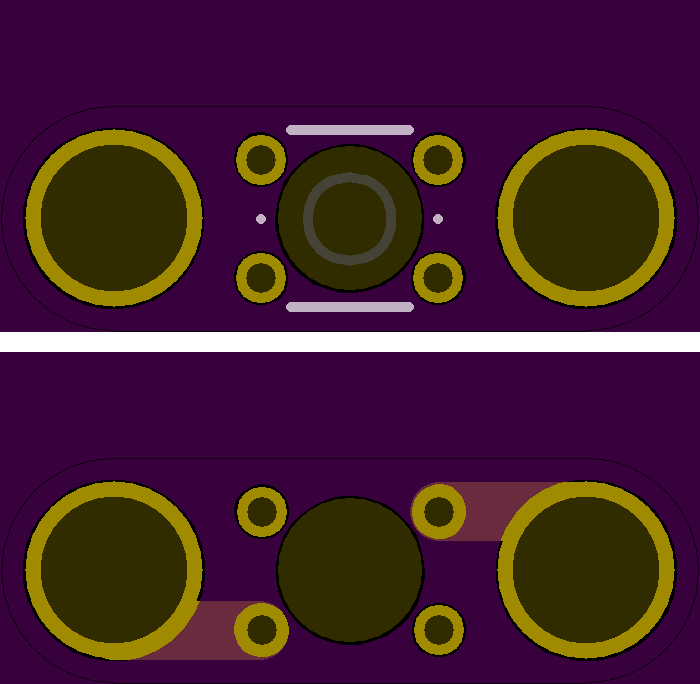

<!--- start title --->
# 1x3 Momentary Pushbutton Module v1.0
A Lego-compatible Rewire Circuits module.

Updated: 18 Dec 2016

Website: http://browndoggadgets.com/
Company: Brown Dog Gadgets
License: All rights reserved.

<!--- end title --->
This is a single momentary pushbutton module. It is normally open, so it only conducts between the two end pads when the button is pressed. 

### Bill of Materials

<!--- bom start --->
|Ref|Qty|Description|Digikey PN|
|---|---|-----------|------|
|SW1|1|SWITCH TACTILE SPST-NO 0.05A 24V|SW400-ND|

<!--- bom end --->
### Board Preview 

