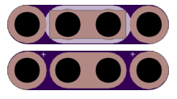

<!--- start title --->
# 1x4 CR2032 Coin Cell v1.0
A Lego-compatible Crazy Circuits module

- Updated: 18 Jan 2017
- Website: http://browndoggadgets.com/
- Company: Brown Dog Gadgets
- License: All rights reserved.

<!--- end title --->
This is an extremely narrow-profile module to hold a 3V coin cell battery.

### Bill of Materials

<!--- bom start --->
|Ref|Qty|Description|Digikey PN|
|---|---|-----------|------|
|BT1|1|HOLDER BATT COIN CR2032/20MM|BK-912-ND|

<!--- bom end --->

