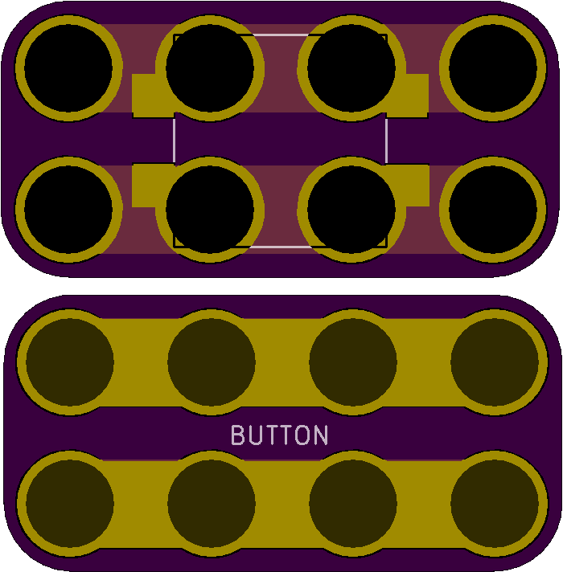

<!--- start title --->
# 2x2 12mm Square SMT Pushbutton Module v1.1
A Lego-compatible Crazy Circuits module

Updated: 27 May 2017
- Website: http://browndoggadgets.com/
- Company: Brown Dog Gadgets
- License: All rights reserved.

<!--- end title --->

This is a large surface mount pushbutton that makes a very satisfying click.

<!--- bom start --->
### Bill of Materials

|Ref|Qty|Description|Digikey PN|
|---|---|-----------|------|
|SW1|1|SWITCH MOMENT SPST-NO 0.05A 24V SMT B3FS-4002P|SW1278CT-ND|

<!--- bom end --->

