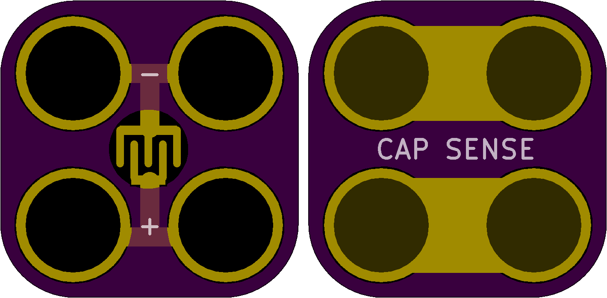

<!--- start title --->
# 2x2 Capacitive Touch Module v1.2
A Lego-compatible Crazy Circuits module.

- Updated: 27 May 2017
- Website: http://browndoggadgets.com/
- Company: Brown Dog Gadgets
- License: CERN Open Hardware License v1.2.

<!--- end title --->
This is a standalone touch sensor to detect changes in capacitance. 

### Manufacturing Notes

This board must be v-scored. Do not panelize with support tabs or mousebites.  

