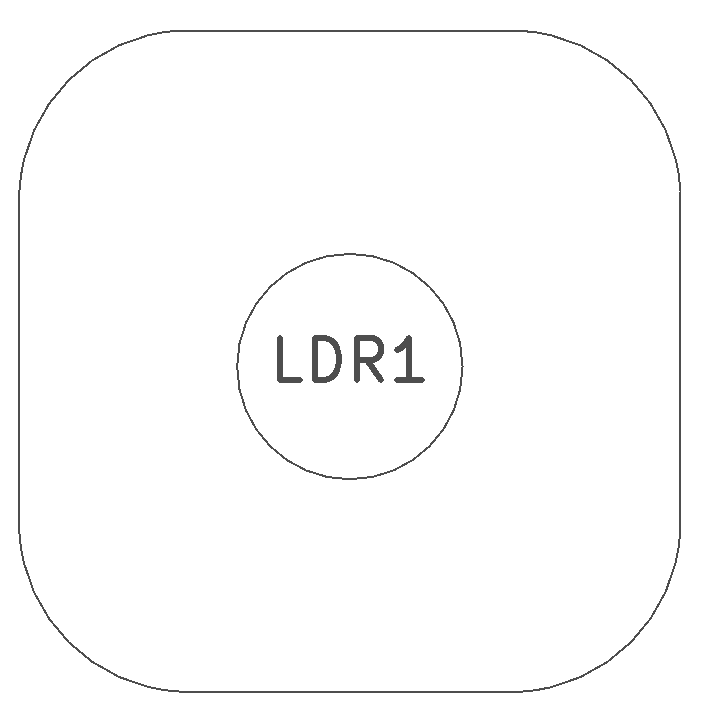
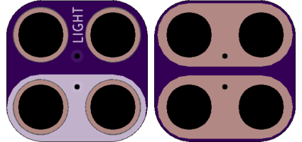

<!--- start title --->
# 2x2 CdS Photocell TH Module v1.2
A Lego-compatible Crazy Circuits module

- Updated: 7 Oct 2017

- Website: http://browndoggadgets.com/
- Company: Brown Dog Gadgets
- License: CERN Open Hardware License v1.2.
<!--- end title --->

This part is also called a Light-Detecting Resistor (LDR), Photoresistor, or CdS cell. The resistance of the part in the dark is almost effectively open at around half a megaohm, but that resistance drops down to 16-33kohm at about the brightness of a candle and then it drops to less than 10kohms as the light increases. 

The photocell is essentially open (not conducting) in the dark, but it starts shorting (conducting more and more) when the light hits it.

<!--- bom start --->
### Bill of Materials

|Ref|Qty|Description|Digikey PN|
|---|---|-----------|------|
|LDR1|1|PHOTOCELL 16-33KOHM|PDV-P8103-ND|

<!--- bom end --->

### Manufacturing Notes

This board must be v-scored. Do not panelize with support tabs or mousebites.

