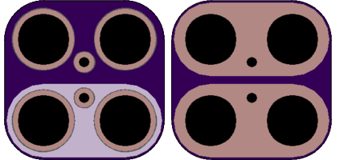

<!--- start title --->
# 2x2 All Purpose 3.5mm Pitch Module v1.0
A Lego-compatible Crazy Circuits module

- Updated: 18 Jan 2017
- Website: http://browndoggadgets.com/
- Company: Brown Dog Gadgets
- License: CERN Open Hardware License v1.2.

<!--- end title --->
This is a generic module with no markings that can be used for any two-pin, 3.5mm-pitch part.

