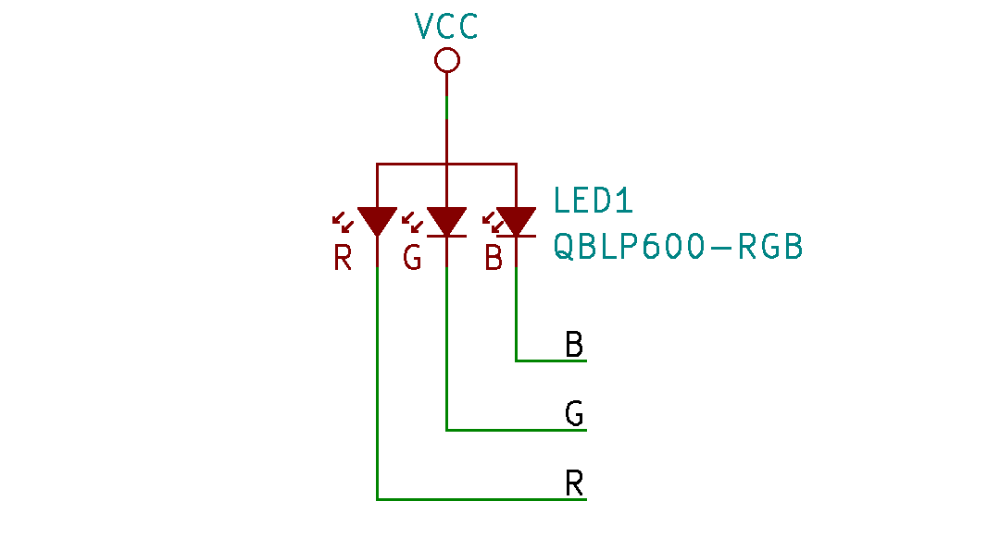
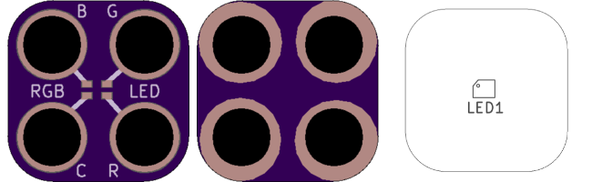

<!--- start title --->
# 2x2 RGB LED SMT v1.0
A Lego-compatible Crazy Circuits module

- Updated: 19 Jan 2017
- Website: http://browndoggadgets.com/
- Company: Brown Dog Gadgets
- License: All rights reserved.

<!--- end title --->
Surface mount RGB LED with a common anode. Connect the Common (C) to 3.3V.

### Bill of Materials

<!--- bom start --->
|Ref|Qty|Description|Digikey PN|
|---|---|-----------|------|
|LED1|1|LED CHIP RGB WTR CLR 0606 SMD|1516-1184-1-ND|

<!--- bom end --->

