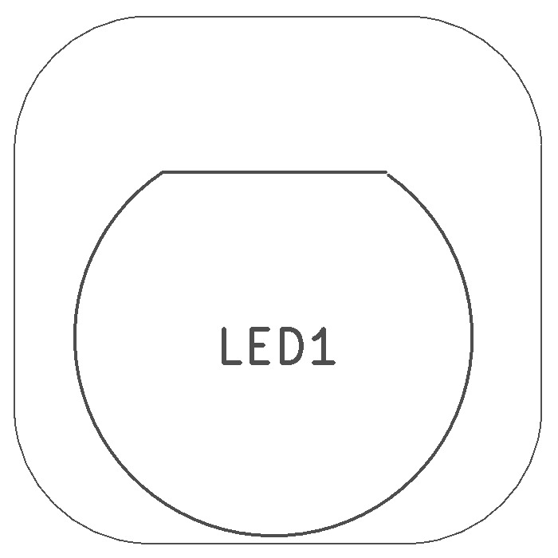
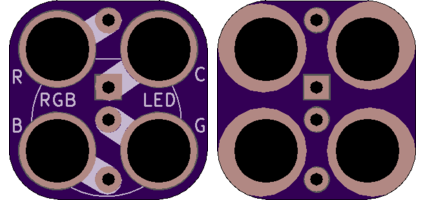

<!--- start title --->
# 2x2 RGB LED TH Module v1.0
A Lego-compatible Crazy Circuits module

- Updated: 19 Jan 2017
- Website: http://browndoggadgets.com/
- Company: Brown Dog Gadgets
- License: All rights reserved.

<!--- end title --->
10mm Red-Green-Blue 4-pin LED. Align the straight edge of the LED with the Red pin. 

### Bill of Materials

<!--- bom start --->
|Ref|Qty|Description|Digikey PN|
|---|---|-----------|------|
|LED1|1|DIFFUSED LED - RGB 10MM|1568-1215-ND|

<!--- bom end --->

	
