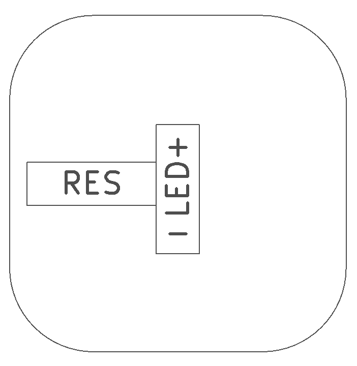
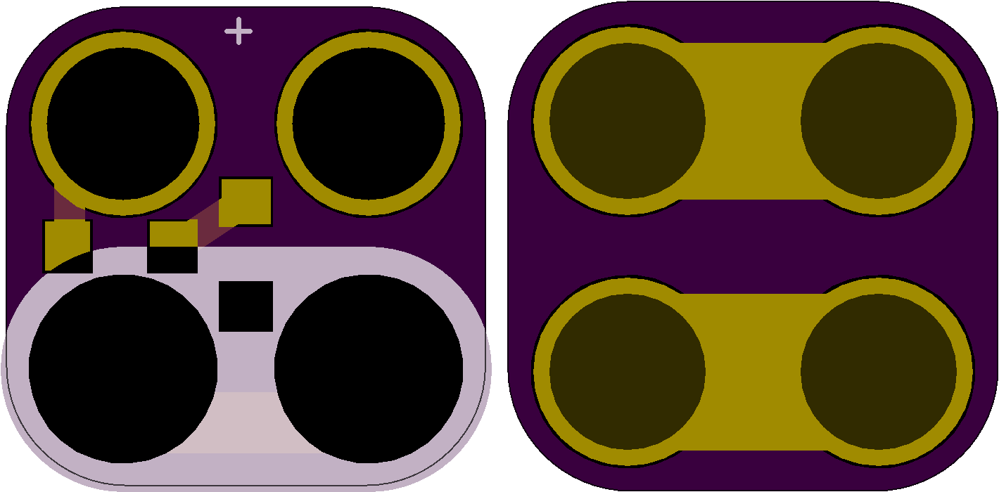

<!--- start title --->
# 2x2 Current-Limited Surface Mount LED Module v1.2
A Lego-compatible Crazy Circuits module.

- Updated: 27 May 2017
- Website: http://browndoggadgets.com/
- Company: Brown Dog Gadgets
- License: All rights reserved.

<!--- end title --->
Attaching an LED directly to a microcontroller's output pins can damage the pins, so this module has the LED in series with a current-limiting resistor. At 100 ohms, it can be used with both 3V and 5V power sources and still emit a red light.

<!--- bom start --->
### Bill of Materials

|Ref|Qty|Description|Digikey PN|
|---|---|-----------|------|
|LED1|1|LED RED 2V 625NM 1206 SMT|732-4991-1-ND|
|R1|1|RES 100 OHM 5% 1/4W 1206|311-100ERCT-ND|

<!--- bom end --->
### Assembly Diagram

### Board Previews

