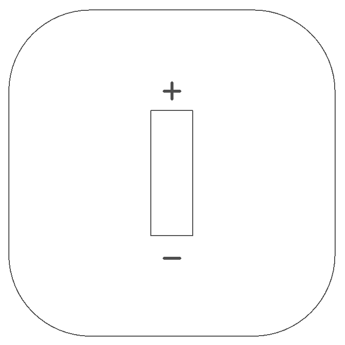
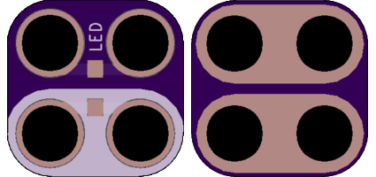

<!--- start title --->
# 2x2 SMT LED v1.0
A Lego-compatible Rewire Circuits module.

Updated: 19 Dec 2016

Website: http://browndoggadgets.com/
Company: Brown Dog Gadgets
License: All rights reserved.

<!--- end title --->
This is a red LED that can be wired in series with a coin cell battery.

### Bill of Materials

<!--- bom start --->
|Ref|Qty|Description|Digikey PN|
|---|---|-----------|------|
|LED1|1|LED RED 2V 625NM 1206 SMT|732-4991-1-ND|

<!--- bom end --->

