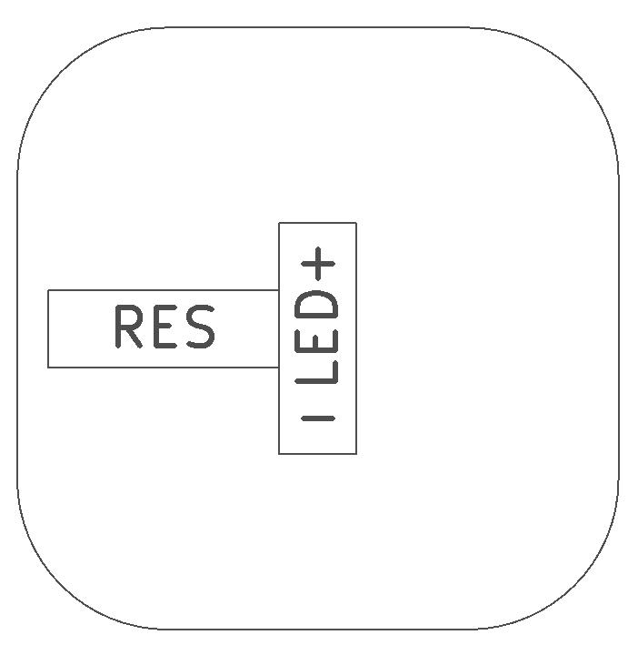
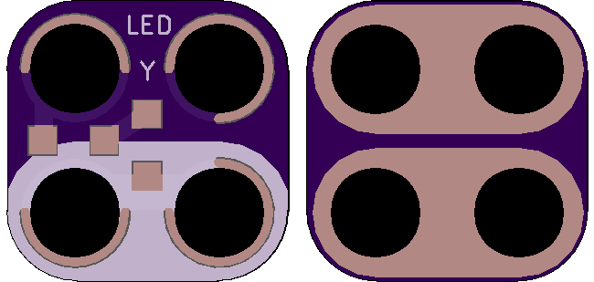

<!--- start title --->
# 2x2 Current-Limited Yellow SMT LED Module v1.0
A Lego-compatible Crazy Circuits module

- Updated: 9 May 2018

- Website: http://browndoggadgets.com/
- Company: Brown Dog Gadgets
- License: CERN Open Hardware License v1.2.
<!--- end title --->

Attaching an LED directly to a microcontroller's output pins can damage the pins, so this module has the LED in series with a current-limiting resistor. 

The yellow LED has a forward voltage drop of 2V, so we recommend a resistor of 100 ohms so the module can be used with both 3V and 5V power sources and still emit a yellow light.

<!--- bom start --->
### Bill of Materials

|Ref|Qty|Description|Digikey PN|
|---|---|-----------|------|
|LED1|1|LED YELLOW CLEAR SMT 1206|732-4994-1-ND|
|R1|1|RES 100 OHM 5% 1/4W 1206|311-100FRCT-ND|

<!--- bom end --->

### Manufacturing Notes

This board must be v-scored. Do not panelize with support tabs or mousebites.

