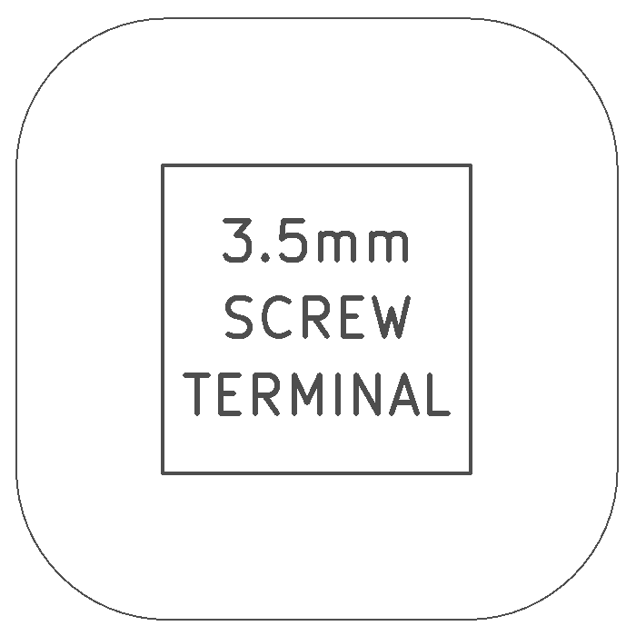
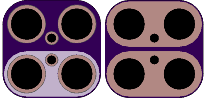

<!--- start title --->
# 2x2 Screw Terminal, 3.5mm Pitch v1.2
A Lego-compatible Crazy Circuits module

- Updated: 7 Oct 2017
- Website: http://browndoggadgets.com/
- Company: Brown Dog Gadgets
- License: CERN Open Hardware License v1.2.

<!--- end title --->
Module for a 2-position 3.5mm-pitch screw terminal. 

<!--- bom start --->
### Bill of Materials

|Ref|Qty|Description|Digikey PN|
|---|---|-----------|------|
|J1|1|SCREW TERMINAL 3.5MM PITCH 1x2|ED2740-ND|

<!--- bom end --->

### Manufacturing Notes

This board must be v-scored. Do not panelize with support tabs or mousebites.

