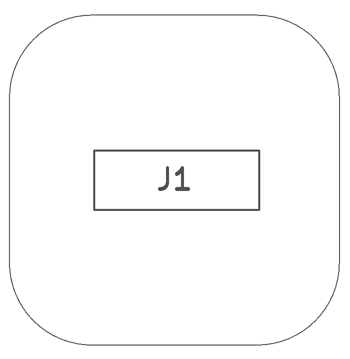
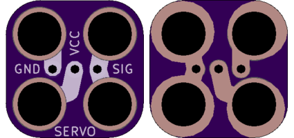

<!--- start title --->
# 2x2 Servo Header Module v1.0
A Lego-compatible Crazy Circuits module

- Updated: 13 Feb 2017
- Website: http://browndoggadgets.com/
- Company: Brown Dog Gadgets
- License: All rights reserved.

<!--- end title --->
A simple three-pin male header breaks out a female servo connector. The servo wires are Black (GND), Red (VCC), and Orange (SIGNAL). 

<!--- bom start --->
### Bill of Materials

|Ref|Qty|Description|Digikey PN|
|---|---|-----------|------|
|J1|1|MALE PIN HEADER 1x3 2.54MM PITCH|732-5316-ND|

<!--- bom end --->

