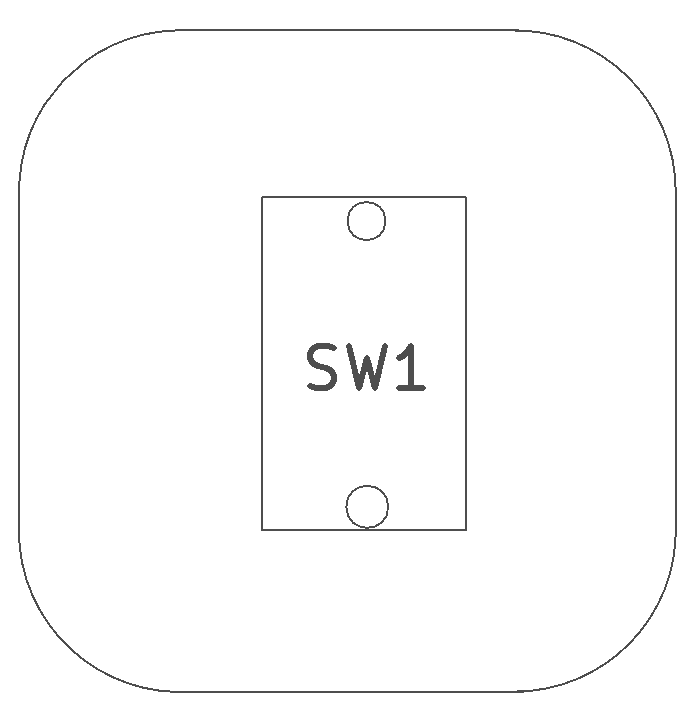
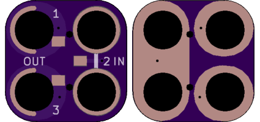

<!--- start title --->
# 2x2 Slide Switch (CL-SB) SMT v1.1
A Lego-compatible Crazy Circuits module

Updated: 26 May 2017
- Website: http://browndoggadgets.com/
- Company: Brown Dog Gadgets
- License: CERN Open Hardware License v1.2.
<!--- end title --->

This is a slide switch module with three positions. 

<!--- bom start --->
### Bill of Materials

|Ref|Qty|Description|Digikey PN|
|---|---|-----------|------|
|SW1|1|SWITCH SLIDE SPDT 200MA 12V CL-SB|563-1314-1-ND|

<!--- bom end --->

