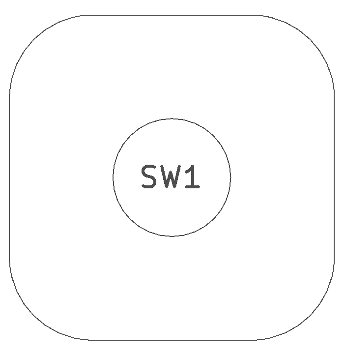
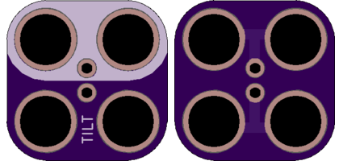

<!--- start title --->
# 2x2 Tilt Switch (SW-520D) TH Module v1.0
A Lego-compatible Crazy Circuits module

- Updated: 7 Oct 2017
- Website: http://browndoggadgets.com/
- Company: Brown Dog Gadgets
- License: All rights reserved.
<!--- end title --->

This simple tilt switch is either closed or open, depending on which end of the tube the ball has rolled down.

This board supports any ball tilt switch whose leads can fit a pitch of 2.4mm. We are specifying the [http://funduino.de/DL/SW-520D.pdf](Bailin SW-520 Roll Ball Switch).

<!--- bom start --->
### Bill of Materials

|Ref|Qty|Description|Alibaba PN|
|---|---|-----------|------|
|SW1|1|TILT SENSOR ROLLING BALL SW-520D|SW-520D|

<!--- bom end --->

