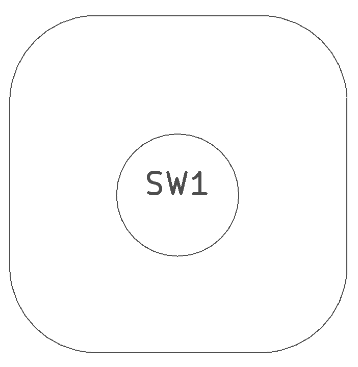
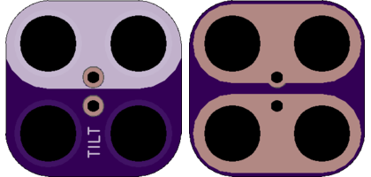

<!--- start title --->
# 2x2 Tilt Switch TH v1.0
A Lego-compatible Crazy Circuits module

- Updated: 17 Mar 2017

- Website: http://browndoggadgets.com/
- Company: Brown Dog Gadgets
- License: All rights reserved.
<!--- end title --->

This simple tilt switch is either closed or open, depending on which end of the tube the ball has rolled down.

<!--- bom start --->
### Bill of Materials

|Ref|Qty|Description|Mouser PN|
|---|---|-----------|------|
|SW1|1|TILT SENSOR ROLLING BALL 107-2006-EV|107-2006-EV|

<!--- bom end --->

