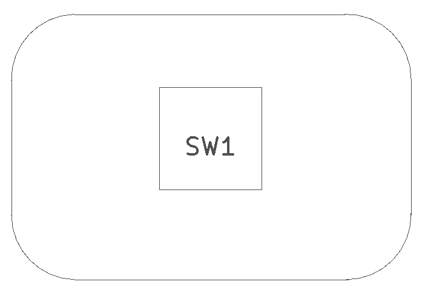
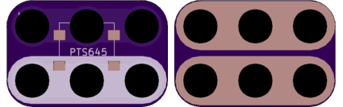

<!--- start title --->
# 2x3 6mm Square SMT Pushbutton Module v1.1
A Lego-compatible Crazy Circuits module

- Updated: 27 May 2017
- Website: http://browndoggadgets.com/
- Company: Brown Dog Gadgets
- License: CERN Open Hardware License v1.2.

<!--- end title --->
This is a small surface mount pushbutton.

<!--- bom start --->
### Bill of Materials

|Ref|Qty|Description|Digikey PN|
|---|---|-----------|------|
|SW1|1|SWITCH MOMENT SPST-NO 0.05A 14V SMT PTS645|CKN9112TR-ND|

<!--- bom end --->

