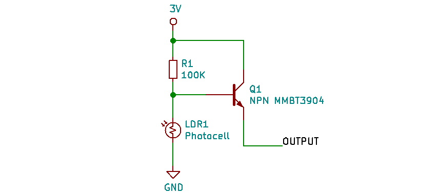
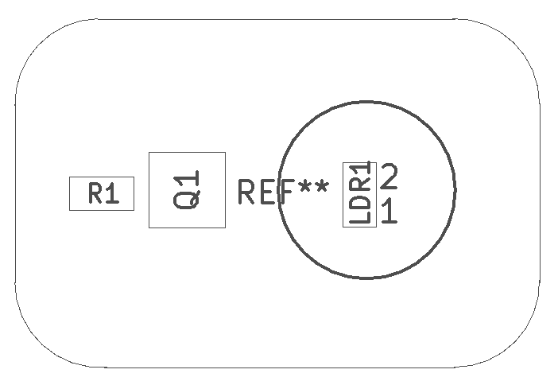
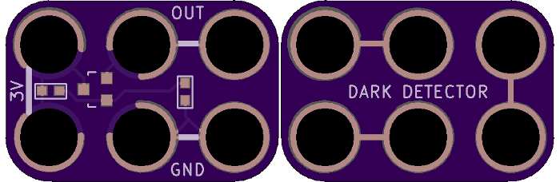

<!--- start title --->
# 2x3 Dark Detector Module v1.0
A Lego-compatible Crazy Circuits module

- Updated: 13 Sep 2018

- Website: http://browndoggadgets.com/
- Company: Brown Dog Gadgets
- License: All rights reserved.
<!--- end title --->

This circuit applies 3V to turn a transistor on and off, based on whether the on-board photocell detects light. The output will go high if there is no light.

<!--- bom start --->
## Bill of Materials

|Ref|Qty|Description|Digikey PN|
|---|---|-----------|------|
|LDR1|1|PHOTOCELL 16-33KOHM|PDV-P8103-ND|
|Q1|1|TRANS NPN 40V 0.2A SOT-23|MMBT3904TPMSCT-ND|
|R1|1|RES SMD 100K OHM 5% 1/10W 0603|311-100KGRCT-ND|

<!--- bom end --->

