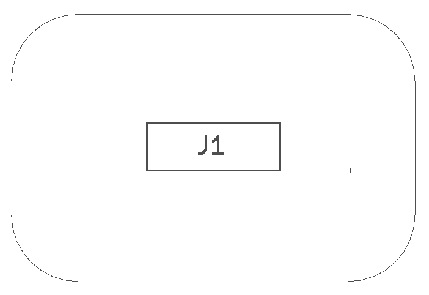
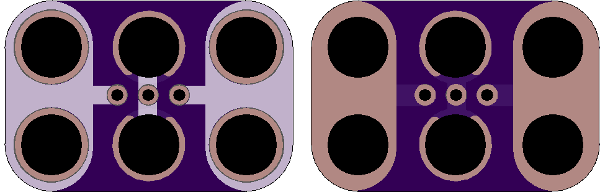

<!--- start title --->
# 2x3 Female Servo Header Module v1.0
A Lego-compatible Crazy Circuits module

- Updated: 17 Apr 2019

- Website: http://browndoggadgets.com/
- Company: Brown Dog Gadgets
- License: All rights reserved.
<!--- end title --->

A simple three-pin female header breaks out a male servo connector. The servo wires are Black (GND), Red (VCC), and Orange (SIGNAL). The board is not marked with polarity marks and is reversible, so it can be used with any sort of three-pin header.

<!--- bom start --->
## Bill of Materials

|Ref|Qty|Description|Digikey PN|
|---|---|-----------|------|
|J1|1|HEADER FEMALE 3POS TH 1x03 0.1IN|952-1784-ND|

<!--- bom end --->

### Manufacturing Notes

This board must be v-scored. Do not panelize with support tabs or mousebites.

