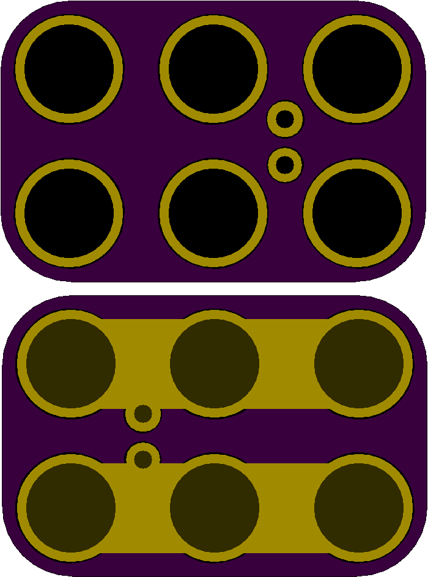

<!--- start title --->
# 2x3 Magnet-compatibel 2.54mm-pitch Module v1.0
A Lego-compatible Crazy Circuits module

Updated: 13 Jan 2017

Website: http://browndoggadgets.com/
Company: Brown Dog Gadgets
License: All rights reserved.

<!--- end title --->
This is a generic module with no markings that can be used for any two-pin, 2.54mm-pitch part. It is a 2x3 for easier connections to Crazy Circuit-compatible magnets.

