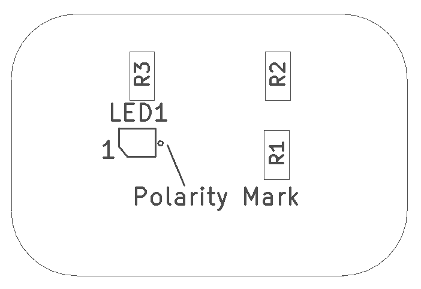
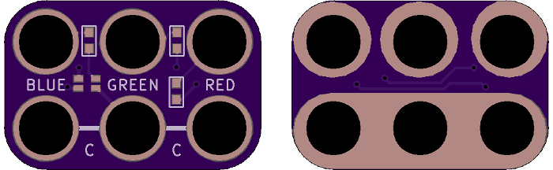

<!--- start title --->
# 2x3 LED RGB (A) SMT v1.1
A Lego-compatible Crazy Circuits module

- Updated: 15 May 2018

- Website: http://browndoggadgets.com/
- Company: Brown Dog Gadgets
- License: CERN Open Hardware License v1.2.
<!--- end title --->

Surface mount RGB LED with a common anode. Connect the Common (C) to 3.3V.

<!--- bom start --->
### Bill of Materials

|Ref|Qty|Description|Digikey PN|
|---|---|-----------|------|
|LED1|1|LED CHIP RGB 19-237 0606 SMD |1080-1590-1-ND|
|R1 R2|2|RES SMD 100 OHM 1% 1/10W 0603|A106047CT-ND|
|R3|1|RES 47 OHM 5% 1/10W 0603|311-47GRCT-ND|

<!--- bom end --->

