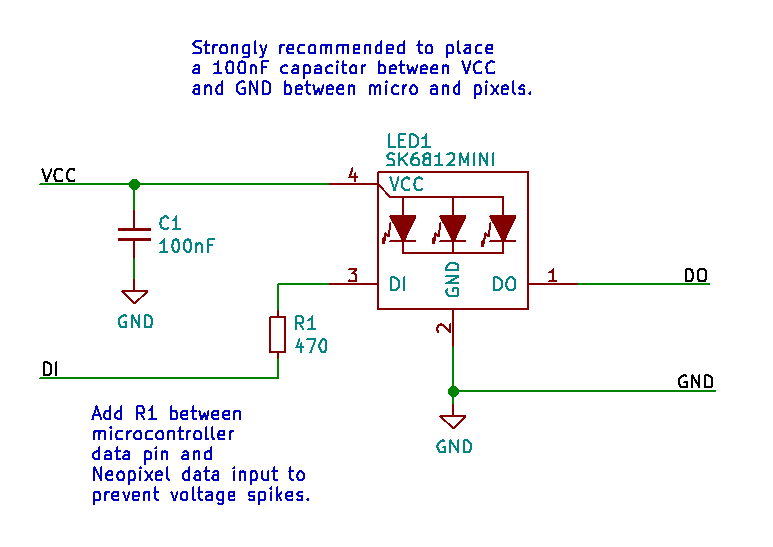
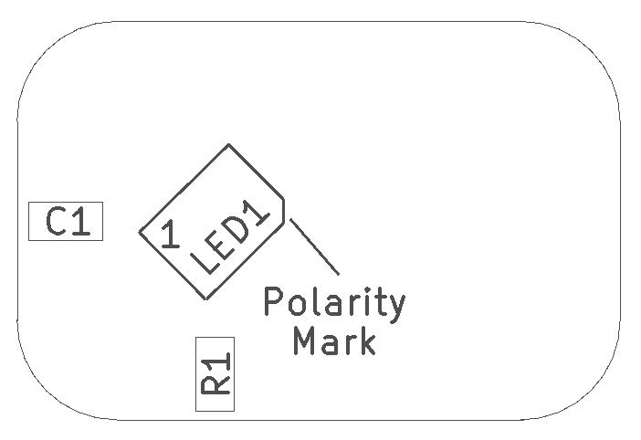
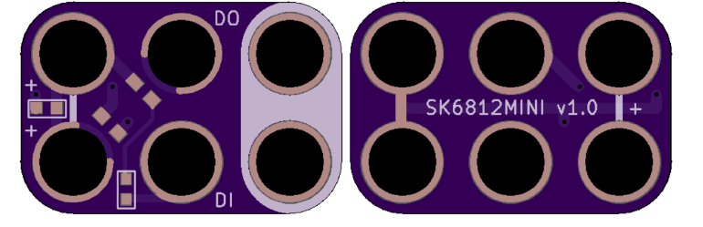

<!--- start title --->
# 2x3 LED RGB SK6812 Mini SMT Module v1.0
A Lego-compatible Crazy Circuits module

- Updated: 1 Jan 2019

- Website: http://browndoggadgets.com/
- Company: Brown Dog Gadgets
- License: All rights reserved.
<!--- end title --->

The WS2812B is an RGB LED that's addressable using the Adafruit Neopixel library for Arduino. Neopixels can be chained together by connecting the DOUT pin of one Neopixel to the DIN pin of the next Neopixel.

An onboard 0.1uF capacitor protects the Neopixel from the controller and the 470-ohm resistor on DIN helps the microcontroller talk reliably to the Neopixel.

Strings, rings, and chains of Neopixels can be found at [Adafruit](http://adafruit.com).

<!--- bom start --->
## Bill of Materials

|Ref|Qty|Description|Digikey PN|
|---|---|-----------|------|
|C1|1|CAP CER 0.1UF 25V X7R 0603|311-1341-1-ND|
|LED1|1|LED RGB SK6812MINI 4SMD|1528-1542-ND|
|R1|1|RES SMD 470 OHM 5% 1/4W 0603|RHM470DCT-ND|

<!--- bom end --->

### Manufacturing Notes

This board must be v-scored. Do not panelize with support tabs or mousebites.

