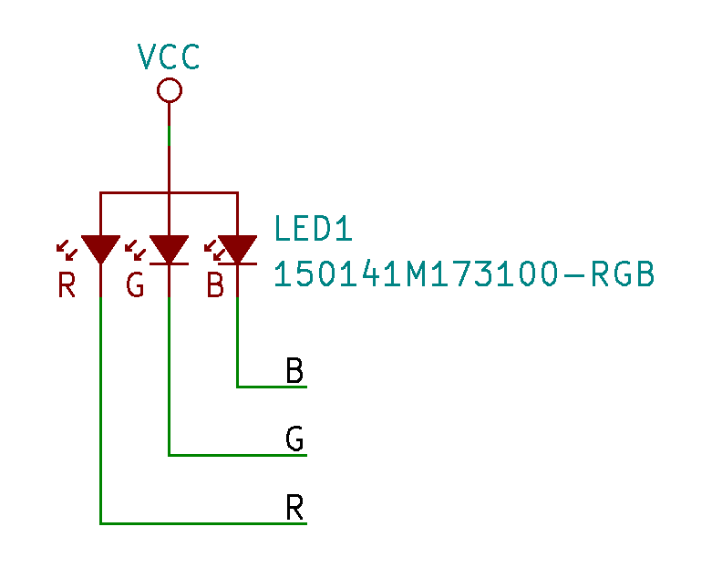
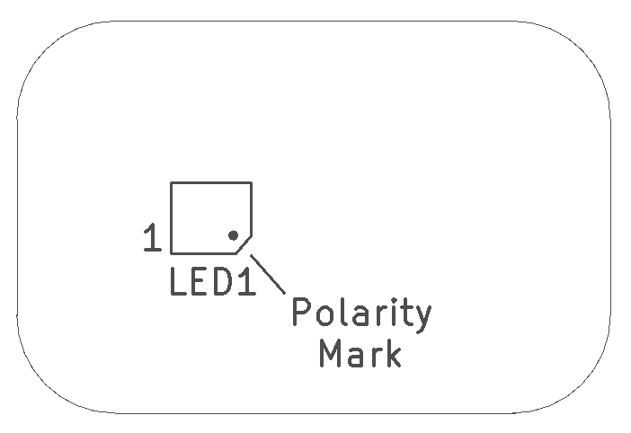
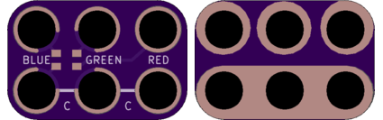

<!--- start title --->
# 2x3 LED RGB SMT Round Flat Top v1.0
A Lego-compatible Crazy Circuits module

- Updated: 29 May 2017
- Website: http://browndoggadgets.com/
- Company: Brown Dog Gadgets
- License: CERN Open Hardware License v1.2.
<!--- end title --->

Surface mount RGB LED with a common anode. 

<!--- bom start --->
### Bill of Materials

|Ref|Qty|Description|Digikey PN|
|---|---|-----------|------|
|LED1|1|LED RGB CLEAR 1411 SMD|732-4998-2-ND|
<!--- bom end --->

