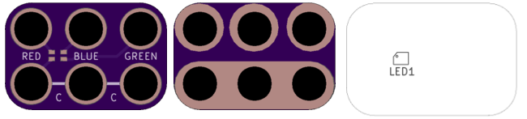
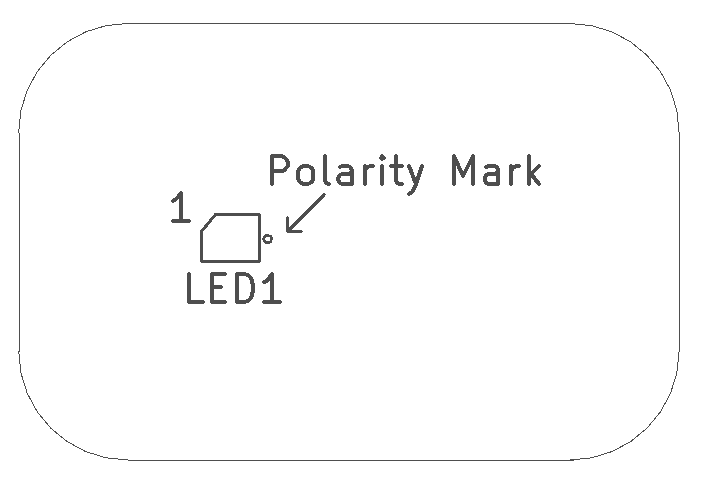

<!--- start title --->
# 2x3 LED RGB SMT v1.1
A Lego-compatible Crazy Circuits module

Updated: 29 May 2017
- Website: http://browndoggadgets.com/
- Company: Brown Dog Gadgets
- License: All rights reserved.

<!--- end title --->
Surface mount RGB LED with a common anode. Connect the Common (C) to 3.3V.

<!--- bom start --->
### Bill of Materials

|Ref|Qty|Description|Digikey PN|
|---|---|-----------|------|
|LED1|1|LED CHIP RGB WTR CLR 0606 SMD|1516-1184-1-ND|

<!--- bom end --->

