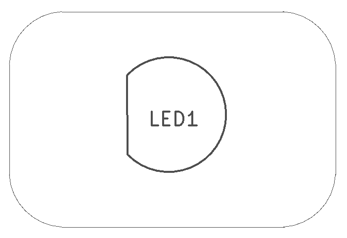
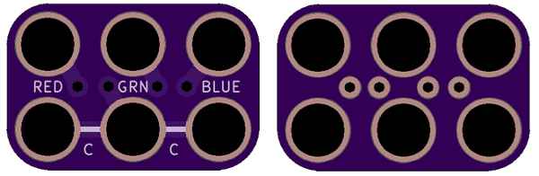
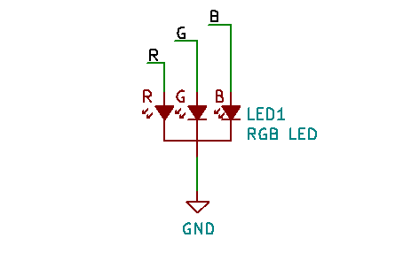

<!--- start title --->
# 2x3 RGB LED 4-pin TH Module v1.0
A Lego-compatible Crazy Circuits module

- Updated: 17 Apr 2019

- Website: http://browndoggadgets.com/
- Company: Brown Dog Gadgets
- License: All rights reserved.
<!--- end title --->

10mm Red-Green-Blue 4-pin LED. Align the straight edge of the LED to the left of the board.

<!--- bom start --->
## Bill of Materials

|Ref|Qty|Description|Digikey PN|
|---|---|-----------|------|
|LED1|1|DIFFUSED LED - RGB 10MM|1568-1215-ND|

<!--- bom end --->

### Manufacturing Notes

This board must be v-scored. Do not panelize with support tabs or mousebites.

