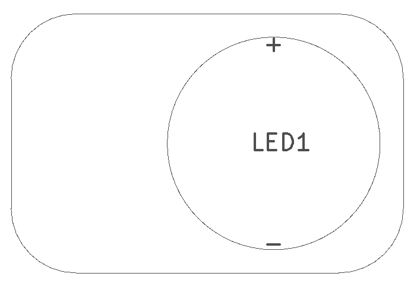
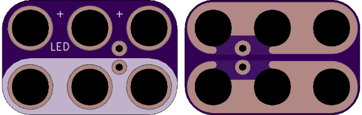

<!--- start title --->
# 2x3 Magnet-compatible LED (2.54mm Pitch) v1.2
A Lego-compatible Crazy Circuits module

- Updated: 7 Oct 2017
- Website: http://browndoggadgets.com/
- Company: Brown Dog Gadgets
- License: All rights reserved.

<!--- end title --->

This part fits any LED with 2.54mm-pitch pins. The LED can be wired in series with a coin cell battery without any other parts.

<!--- bom start --->
### Bill of Materials

|Ref|Qty|Description|Digikey PN|
|---|---|-----------|------|
|LED1|1|LED GREEN 10MM DIA 2.54MM PITCH TH|754-1898-ND|

<!--- bom end --->

