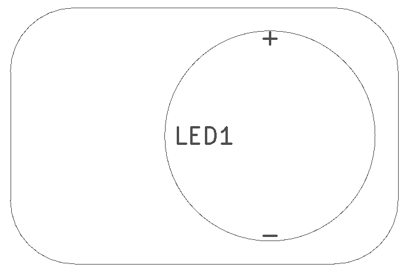
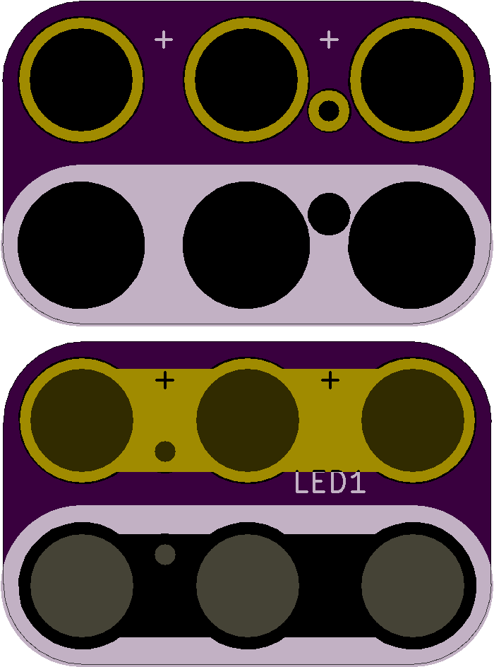

<!--- start title --->
# 2x3 Magnet-compatible LED (5mm Pitch) Module v1.1
A Lego-compatible Crazy Circuits module.

- Updated: 19 Dec 2016
- Website: http://browndoggadgets.com/
- Company: Brown Dog Gadgets
- License: CERN Open Hardware License v1.2.

<!--- end title --->

There is no part currently specified for this module. Any LED with 5mm pin pitch will work.

