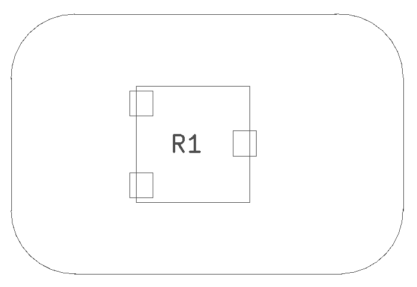
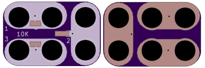

<!--- start title --->
# 2x3 Mini Potentiometer 3361P SMT Module v1.0
A Lego-compatible Crazy Circuits module

- Updated: 17 Mar 2017

- Website: http://browndoggadgets.com/
- Company: Brown Dog Gadgets
- License: All rights reserved.
<!--- end title --->

This is a small 10K trim potentiometer that requires a little screwdriver to increase or decrease the resistance. 

<!--- bom start --->
### Bill of Materials

|Ref|Qty|Description|Digikey PN|
|---|---|-----------|------|
|R1|1|TRIMMER 10K OHM 0.5W SMD|3361P-103GLFCT-ND|

<!--- bom end --->

