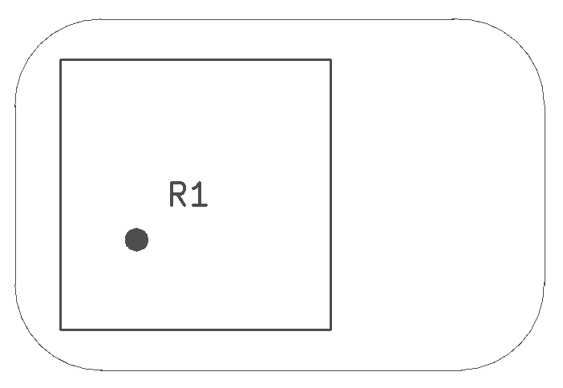
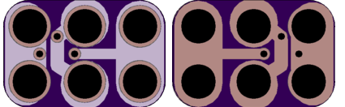

<!--- start title --->
# 2x3 Mini Potentiometer 3386P TH v1.2
A Lego-compatible Crazy Circuits module

- Updated: 7 Oct 2017
- Website: http://browndoggadgets.com/
- Company: Brown Dog Gadgets
- License: CERN Open Hardware License v1.2.

<!--- end title --->

This is a small 10K trim potentiometer that will fit the 3386P-compatible footprints, but the 3386P particularly has a nice twisty knob on top that can be turned by hand instead of requiring a screwdriver.

<!--- bom start --->
### Bill of Materials

|Ref|Qty|Description|Digikey PN|
|---|---|-----------|------|
|R1|1|TRIMMER 10K OHM 0.5W|3386P-103TLF-ND|

<!--- bom end --->

### Manufacturing Notes

This board must be v-scored. Do not panelize with support tabs or mousebites.

