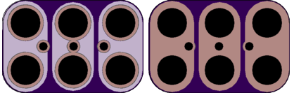

<!--- start title --->
# 2x3 Potentiometer (P160K) Module v1.3
A Lego-compatible Crazy Circuits module

- Updated: 7 Oct 2017
- Website: http://browndoggadgets.com/
- Company: Brown Dog Gadgets
- License: CERN Open Hardware License v1.2.

<!--- end title --->
This is a 10K potentiometer. 

<!--- bom start --->
### Bill of Materials

|Ref|Qty|Description|Digikey PN|
|---|---|-----------|------|
|R1|1|POT 10K OHM 1/5W PLASTIC LINEAR|987-1301-ND|

<!--- bom end --->

### Manufacturing Notes

This board must be v-scored. Do not panelize with support tabs or mousebites.

