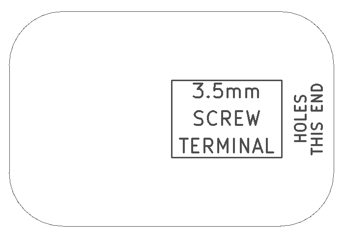
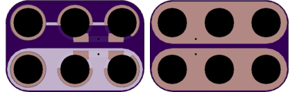

<!--- start title --->
# 2x3 Push Terminal 3mm Pitch SMT v1.1
A Lego-compatible Crazy Circuits module

- Updated: 28 May 2017
- Website: http://browndoggadgets.com/
- Company: Brown Dog Gadgets
- License: CERN Open Hardware License v1.2.
<!--- end title --->

A two-pin terminal block that lets you push the wire in instead of requiring a screwdriver.

<!--- bom start --->
### Bill of Materials

|Ref|Qty|Description|Digikey PN|
|---|---|-----------|------|
|J1|1|CONN MINI LITE-TRAP RCPT 2POS|WM11924CT-ND|

<!--- bom end --->

### Manufacturing Notes

This board must be v-scored. Do not panelize with support tabs or mousebites.

