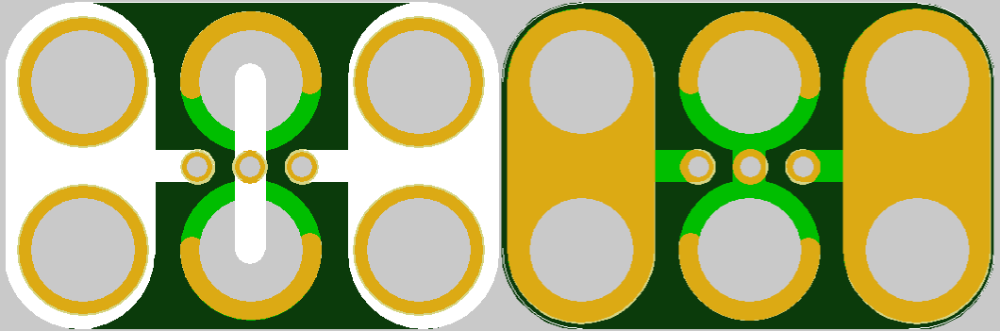

<!--- start title --->
# 2x3 Slide Switch TH (EG1218) v1.3
A Lego-compatible Crazy Circuits module

- Updated: 7 Oct 2017
- Website: http://browndoggadgets.com/
- Company: Brown Dog Gadgets
- License: CERN Open Hardware License v1.2.
<!--- end title --->

This is a slide switch module with three positions. 

<!--- bom start --->
### Bill of Materials

|Ref|Qty|Description|Digikey PN|
|---|---|-----------|------|
|SW1|1|SWITCH SLIDE SPDT 200MA 30V EG1218|EG1903-ND|

<!--- bom end --->

