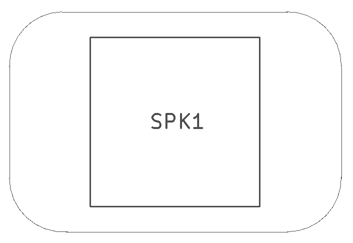

<!--- start title --->
# 2x3 Speaker 11mm Pitch Module v1.1
A Lego-compatible Crazy Circuits module

- Updated: 27 May 2017
- Website: http://browndoggadgets.com/
- Company: Brown Dog Gadgets
- License: All rights reserved.
<!--- end title --->

This module is a simple bidirectional Piezo speaker that makes sound when voltage is applied. You can connect it in either direction.

<!--- bom start --->
### Bill of Materials

|Ref|Qty|Description|Digikey PN|
|---|---|-----------|------|
|SPK1|1|SPEAKER PIEZO 25V SMD PKLCS1212E4001-R1|490-4683-1-ND|

<!--- bom end --->

