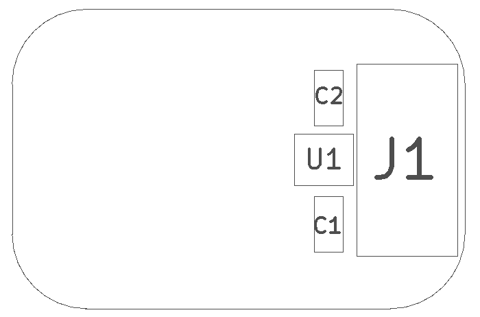
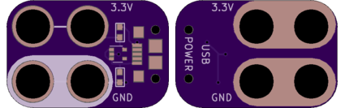

<!--- start title --->
# 2x3 USB Power Connector Module v1.1
A Lego-compatible Crazy Circuits module

- Updated: 27 May 2017
- Website: http://browndoggadgets.com/
- Company: Brown Dog Gadgets
- License: CERN Open Hardware License v1.2.

<!--- end title --->
Micro-USB connector edge piece that breaks out 3.3V from the USB 5V along with the GND. This could be used instead of a coin cell battery.

<!--- bom start --->
### Bill of Materials

|Ref|Qty|Description|Digikey PN|
|---|---|-----------|------|
|C1 C2|2|CAP CER 1UF 25V X7R 0603|587-2984-1-ND|
|J1|1|USB MICRO-B RECEPTACLE 5PIN SMT R/A STUDS|609-4616-1-ND|
|U1|1|IC REG LDO 3.3V 0.15A SOT353|576-3193-1-ND|

<!--- bom end --->

### Manufacturing Notes

This board must be v-scored. Do not panelize with support tabs or mousebites.

