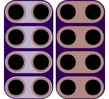

<!--- start title --->
# 2x4 Cap Sense Slider Module v1.0
A Lego-compatible Crazy Circuits module

- Updated: 13 Feb 2017
- Website: http://browndoggadgets.com/
- Company: Brown Dog Gadgets
- License: CERN Open Hardware License v1.2.

<!--- end title --->

This is a capsense slider. Wire up each line to an input pin on a Teensy or Arduino, and run your fingers down the capsense rows to use the board as a slider touch detector.

