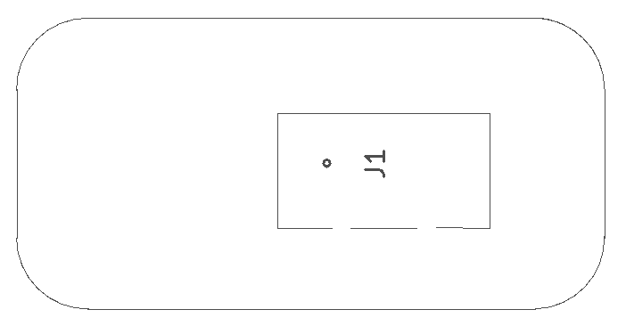
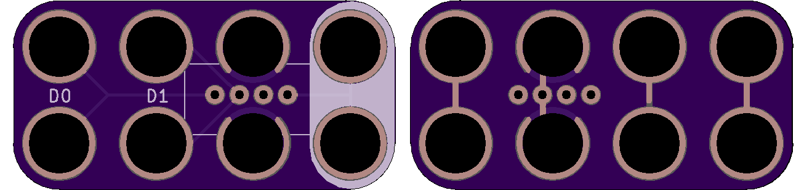

<!--- start title --->
# 2x4 Grove Sensor (Inline) v1.0
A Lego-compatible Crazy Circuits module

- Updated: 9 Feb 2018

- Website: http://browndoggadgets.com/
- Company: Brown Dog Gadgets
- License: All rights reserved.
<!--- end title --->

Breaks out the Seeed Grove sensor connector so you can add Seeed Grove sensors to your project. This is a slightly different pinout than our [regular version](../2x4-Grove-Sensor/).

<!--- bom start --->
### Bill of Materials

|Ref|Qty|Description|Digikey PN|
|---|---|-----------|------|
|J1|1|HEADER MALE 4POS TH 1x04 SEEED GROVE|1597-1082-ND|

<!--- bom end --->

