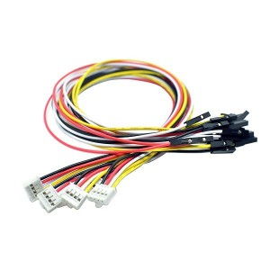
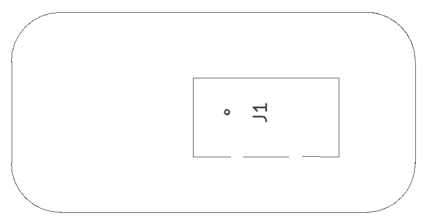
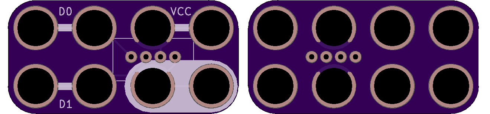

<!--- start title --->
# 2x4 Grove Sensor v1.0
A Lego-compatible Crazy Circuits module

- Updated: 4 Feb 2018

- Website: http://browndoggadgets.com/
- Company: Brown Dog Gadgets
- License: CERN Open Hardware License v1.2.
<!--- end title --->

Use this board to connect a Seeed Grove sensor that uses the 4-pin cable.  

<!--- bom start --->
### Bill of Materials

|Ref|Qty|Description|Digikey PN|
|---|---|-----------|------|
|J1|1|HEADER MALE 4POS TH 1x04 SEEED GROVE|1597-1082-ND|

<!--- bom end --->

### Manufacturing Notes

This board must be v-scored. Do not panelize with support tabs or mousebites.

