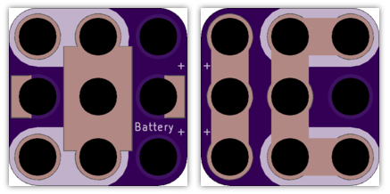

<!--- start title --->
# 3x3 CR2032 Coin Cell Battery Module v1.2
A Lego-compatible Crazy Circuits module.

- Updated: 27 May 2017
- Website: http://browndoggadgets.com/
- Company: Brown Dog Gadgets
- License: CERN Open Hardware License v1.2.

<!--- end title --->
This is a holder for a 3V CR2032 coin cell battery. 

<!--- bom start --->
### Bill of Materials

|Ref|Qty|Description|Digikey PN|
|---|---|-----------|------|
|BT1|1|HOLDER BATT COIN CR2032/20MM|BK-912-ND|

<!--- bom end --->

