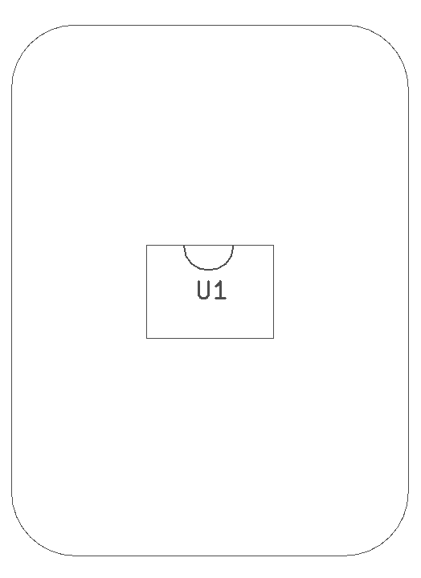
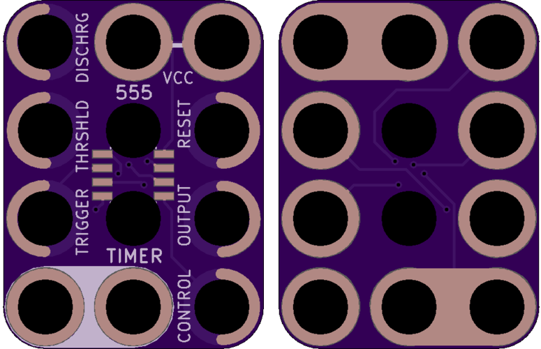

<!--- start title --->
# 3x4 555 Timer 8SOIC Breakout Module v1.1
A Lego-compatible Crazy Circuits module

- Updated: 28 May 2017
- Website: http://browndoggadgets.com/
- Company: Brown Dog Gadgets
- License: All rights reserved.
<!--- end title --->

The 555 Timer is an oscillator that's good for all kinds of timer circuits.

<!--- bom start --->
### Bill of Materials

|Ref|Qty|Description|Digikey PN|
|---|---|-----------|------|
|U1|1|IC OSC 555 TIMER 8-SOIC|LM555CMXFSCT-ND|

<!--- bom end --->

