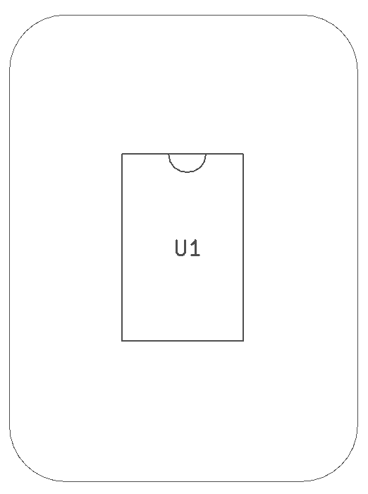
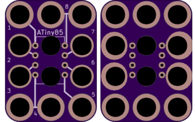

<!--- start title --->
# 3x4 ATtiny85 8DIP Breakout Module v1.3
A Lego-compatible Crazy Circuits module

- Updated: 7 Oct 2017
- Website: http://browndoggadgets.com/
- Company: Brown Dog Gadgets
- License: CERN Open Hardware License v1.2.

<!--- end title --->

This is a breakout board for an ATiny85. 

<!--- bom start --->
### Bill of Materials

|Ref|Qty|Description|Digikey PN|
|---|---|-----------|------|
|U1|1|IC MCU 8BIT ATTINY85 8DIP|ATTINY85-20PU-ND|

<!--- bom end --->

