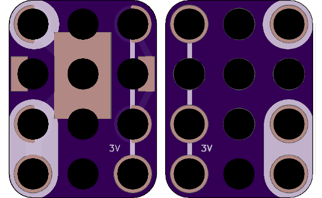
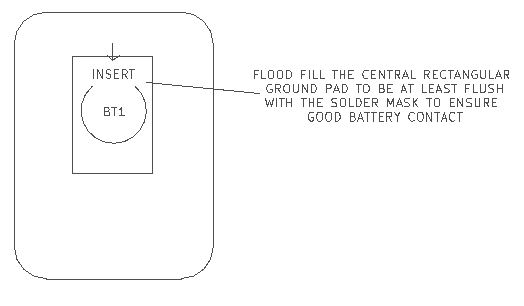

<!--- start title --->
# 3x4 CR2032 Coin Cell Battery Module v1.3
A Lego-compatible Crazy Circuits module.

- Updated: 25 Sep 2018
- Website: http://browndoggadgets.com/
- Company: Brown Dog Gadgets
- License: CERN Open Hardware License v1.2.

<!--- end title --->
This is a holder for a 3V CR2032 coin cell battery. The extra three pads on the bottom make it usable with Crazy-compatible magnets.

<!--- bom start --->
## Bill of Materials

|Ref|Qty|Description|Digikey PN|
|---|---|-----------|------|
|BT1|1|HOLDER BATT COIN CR2032/20MM|BK-912-ND|

<!--- bom end --->

### Manufacturing Notes

This board must be v-scored. Do not panelize with support tabs or mousebites.

The central rectangular ground pad should be tinned (flood filled) with solder to at least as high as flush with the solder mask, to ensure a good connection with the coin cell battery. 

