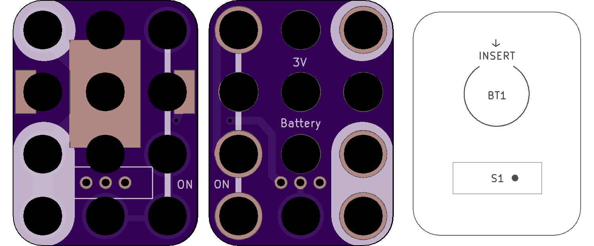
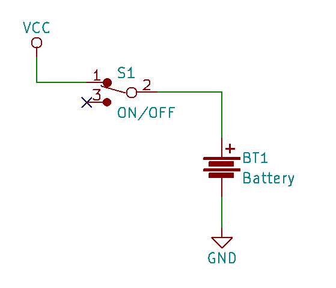

<!--- start title --->
# 3x4 CR2032 Coin Cell On/Off Switch v1.1
A Lego-compatible Crazy Circuits module

- Updated: 25 Sep 2018

- Website: http://browndoggadgets.com/
- Company: Brown Dog Gadgets
- License: All rights reserved.
<!--- end title --->

Use this module to provide 3V from a CR2032 coin cell battery. Turn power on and off with the slide switch.

<!--- bom start --->
## Bill of Materials

|Ref|Qty|Description|Digikey PN|
|---|---|-----------|------|
|BT1|1|HOLDER BATT COIN CR2032/20MM|BK-912-ND|
|S1|1|SWITCH SLIDE SPDT 200MA 30V|EG1903-ND|

<!--- bom end --->

 

